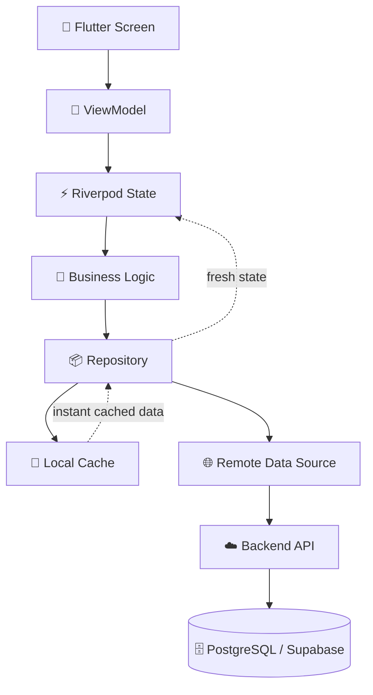
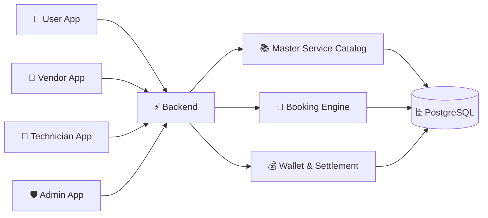

<div align="center">


# 👋 Hey, I'm Aditya 

### 📱 Flutter Developer · 🧩 Product Builder · 🚀 Founder @ FixitBhaii Solutions

<p>
  
  
  
  
</p>

<p>
  <a href="https://fixitbhaii-solutions.vercel.app/">
    
  </a>
  
  
</p>

</div>

---

## 🧑‍💻 About Me

I'm a **Flutter developer and product builder** focused on turning ideas and business workflows into production-ready mobile applications.

I work across the full product journey:

```text
💡 Idea
  ↓
🎨 UI / UX
  ↓
📱 Flutter Application
  ↓
🧠 Architecture & State
  ↓
☁️ Backend & Database
  ↓
🔐 Auth / Payments / Notifications
  ↓
🚀 Deployment
  ↓
📈 Production
```

My main focus is building systems that are **clean, maintainable, secure and practical** — not just applications that look good in a demo.

---

## ⚡ What I Do

| 🛠️ Area | What I work on |
|---|---|
| 📱 **Flutter** | Android & iOS applications, responsive UI, animations |
| 🧠 **Architecture** | Riverpod, MVVM, Clean Architecture, repositories |
| ☁️ **Backend** | Supabase, PostgreSQL, Firebase, APIs |
| 💾 **Data** | Caching, offline-first flows, synchronization |
| 💳 **Payments** | Payment flows, server-side verification, settlements |
| 🔔 **Integrations** | FCM, WebView, APIs, deep links |
| 🚀 **Deployment** | Play Store, app releases, production setup |
| 🧩 **Reusable Code** | Flutter packages, modules and shared components |

---

# 🚀 What I'm Building

## FixitBhaii Solutions

### `Businesses → Mobile`

I'm building **FixitBhaii Solutions** as a focused mobile development studio.

The idea is simple:

> 🌐 **Businesses already have digital products. I help take them mobile.**

### 🔧 Core Services

```text
🌐 Website → 📱 Mobile App

🎨 Custom Flutter Development

☁️ Firebase / Supabase Backend

🔐 Authentication & Secure APIs

🔔 Push Notifications

💳 Payments & Business Workflows

🚀 Play Store Launch

🧩 Reusable Flutter Modules
```

🌐 **Website:** https://solutions.fixitbhaii.com/

---

# 🧱 How I Build

One of the areas I've spent significant time on is creating a Flutter structure where the UI isn't responsible for everything.



### 🎯 Principles

- 🎨 **UI stays focused on presentation**
- 🧠 **Business logic stays outside screens**
- ⚡ **State has a predictable owner**
- 📦 **Repositories abstract data sources**
- 💾 **Cache when it improves UX**
- 🌐 **Backend remains the source of truth**
- 🔐 **Sensitive operations are enforced server-side**
- 🧩 **Reusable solutions become packages/modules**

---

# 🏗️ A Bigger System I'm Building

## FixitBhaii Service Marketplace

A multi-sided platform connecting customers, vendors and technicians.



### 📚 Master Service Catalog

```text
🏢 Division
   └── 📂 Category
        └── 📁 SubCategory
             └── 🔧 Service
```

The catalog acts as the central source of truth across:

`Vendor Onboarding` · `Technician Assignment` · `Discovery` · `Booking` · `Pricing` · `Add-ons` · `FAQs` · `Media`

---

# 🛠️ Tech Stack

### 📱 Mobile


### ☁️ Backend


### 🧠 Architecture

`Riverpod` · `MVVM` · `Clean Architecture` · `Freezed` · `Repository Pattern`

### 🔌 Integrations

`REST APIs` · `WebView` · `FCM` · `Payments` · `Deep Links` · `Storage`

### 🚀 Delivery

`Git` · `GitHub` · `Play Console` · `CI/CD` · `Fastlane`

---

# 📦 Open Source

## 🔗 `fixit_webview`

A Flutter package created around one of the recurring problems I encountered while building mobile products:

### 🌐 Web → 📱 Mobile

The goal is to make WebView-based application wrappers more reusable instead of rebuilding the same foundation for every project.

**Focus:**

`Flutter` · `WebView` · `Navigation` · `Reusable Architecture`

🔗 **pub.dev:** [https://pub.dev/packages/fixit_webview]

---

# 💼 Selected Work

## 🔵 FixitBhaii

**Local Services Marketplace**

A multi-app ecosystem designed around:

👤 Customers  
🏪 Vendors  
🔧 Technicians  
🛡️ Administrators

### Core workflows

`Service Discovery` → `Booking` → `Vendor Assignment` → `Technician Assignment` → `Service Completion` → `Payment` → `Settlement`

---

## 🌐 Website → Mobile Systems

I've worked on the architecture required to transform web-based experiences into mobile products while adding native capabilities such as:

- 🔔 Push notifications
- 💾 Offline handling
- 🔗 Deep linking
- 📱 Native navigation
- 🚀 App-store deployment
- ⚡ Startup/performance optimization

---

# 🧠 Engineering Mindset

```text
┌─────────────────────────────────────────────┐
│              BUILDING > CODING              │
├─────────────────────────────────────────────┤
│                                             │
│  🔍 Understand the problem                  │
│       ↓                                     │
│  🧩 Design the system                       │
│       ↓                                     │
│  🏗️ Build the smallest solid version       │
│       ↓                                     │
│  🧪 Test the edge cases                     │
│       ↓                                     │
│  🔐 Secure the critical operations          │
│       ↓                                     │
│  🚀 Ship it                                 │
│       ↓                                     │
│  📈 Learn from production                   │
│       ↓                                     │
│  🔁 Improve it                               │
│                                             │
└─────────────────────────────────────────────┘
```

I don't want to just write more code.

I want to build **better systems**.

---

# 🌱 Currently Exploring

```text
📱 Advanced Flutter Architecture
🏗️ Scalable Marketplace Systems
☁️ Supabase + PostgreSQL
💾 Offline-First Applications
💳 Payment & Settlement Architecture
🧩 Reusable Flutter Packages
⚡ Application Performance
🚀 Product Engineering
```

# 🤝 Let's Connect

I'm always interested in:

💡 Interesting product ideas  
📱 Mobile development  
🏗️ Architecture discussions  
🧩 Open-source collaboration  
🚀 Building useful products

<div align="center">

<a href="https://github.com/Greatversion">

</a>
<a href="https://www.linkedin.com/in/aditya-verma-87a346240/">

</a>
<a href="https://solutions.fixitbhaii.com/">

</a>

</div>

---

<div align="center">

### 💙 Code. Build. Improve. Repeat.

`Always learning.` · `Always building.` · `Always shipping.`


</div>
